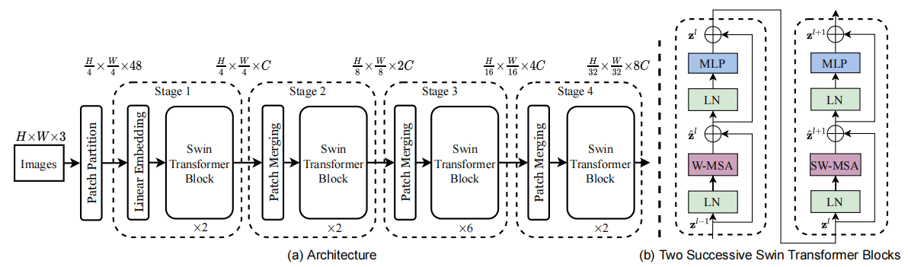

# swin_transformer_from_scratch
pytorch版本实现的swin_transformer, 用于学习目的, 帮助更好的了解它的工作原理。

## Architecture

</img>

## Citation
```bibtex
@inproceedings{liu2021swin,
  title={Swin transformer: Hierarchical vision transformer using shifted windows},
  author={Liu, Ze and Lin, Yutong and Cao, Yue and Hu, Han and Wei, Yixuan and Zhang, Zheng and Lin, Stephen and Guo, Baining},
  booktitle={Proceedings of the IEEE/CVF international conference on computer vision},
  pages={10012--10022},
  year={2021}
}
```
